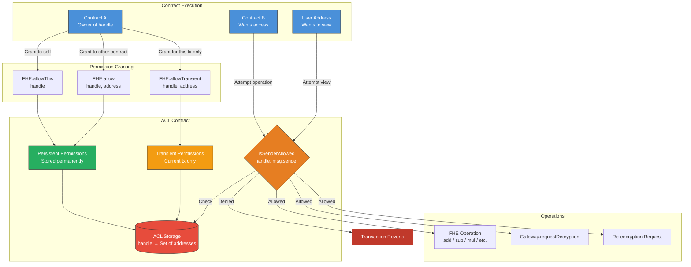
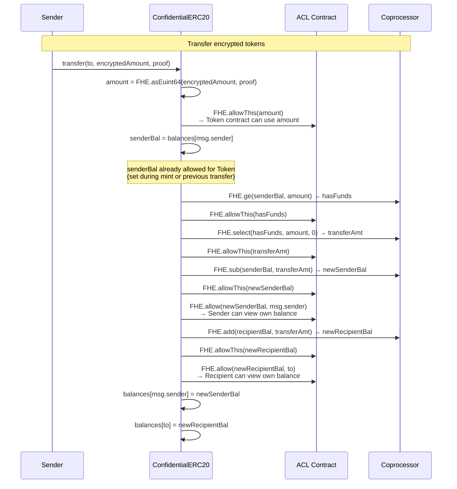
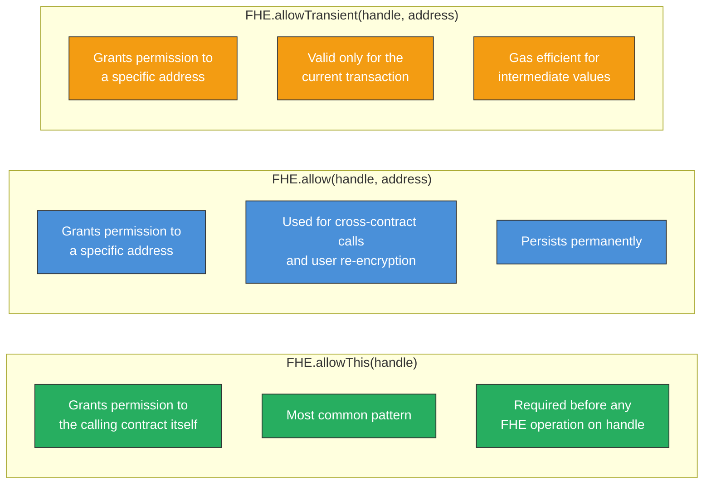

# Access Control List (ACL) Architecture

The ACL system is the permission layer that governs who can operate on, view, or decrypt encrypted values. Without explicit permission, no contract or user can access a ciphertext handle.

## ACL Permission Model

## Permission Flow for Token Transfer

## Three Types of Permission

## Explanation

The ACL is the security backbone of fhEVM. Key rules:

1. **Every new ciphertext handle starts with no permissions.** The contract that creates it must explicitly call `FHE.allowThis()` to grant itself access.
2. **Permissions are per-handle, per-address.** Granting access to one handle does not grant access to others.
3. **Users need explicit permission to view their own data.** The contract must call `FHE.allow(handle, userAddress)` so the user can later request re-encryption.
4. **Cross-contract calls require explicit delegation.** If Contract A passes a handle to Contract B, Contract A must first call `FHE.allow(handle, addressOfB)`.
5. **Transient permissions save gas** when a handle is only needed within a single transaction (e.g., intermediate computation results).
