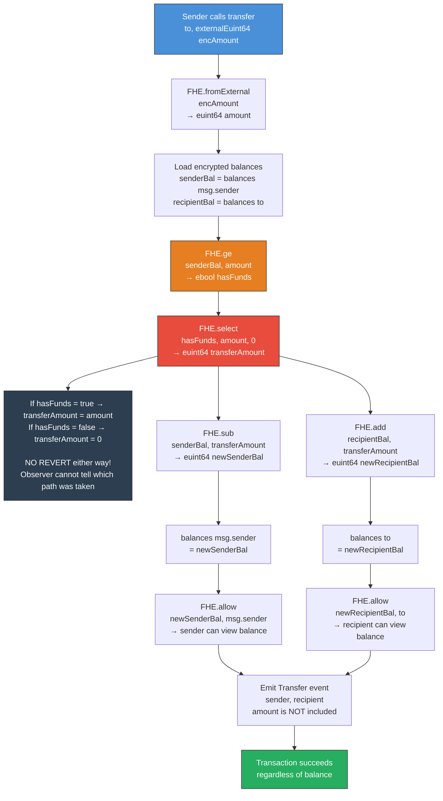
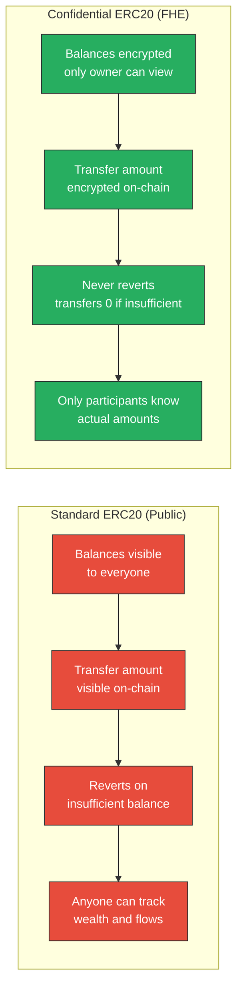
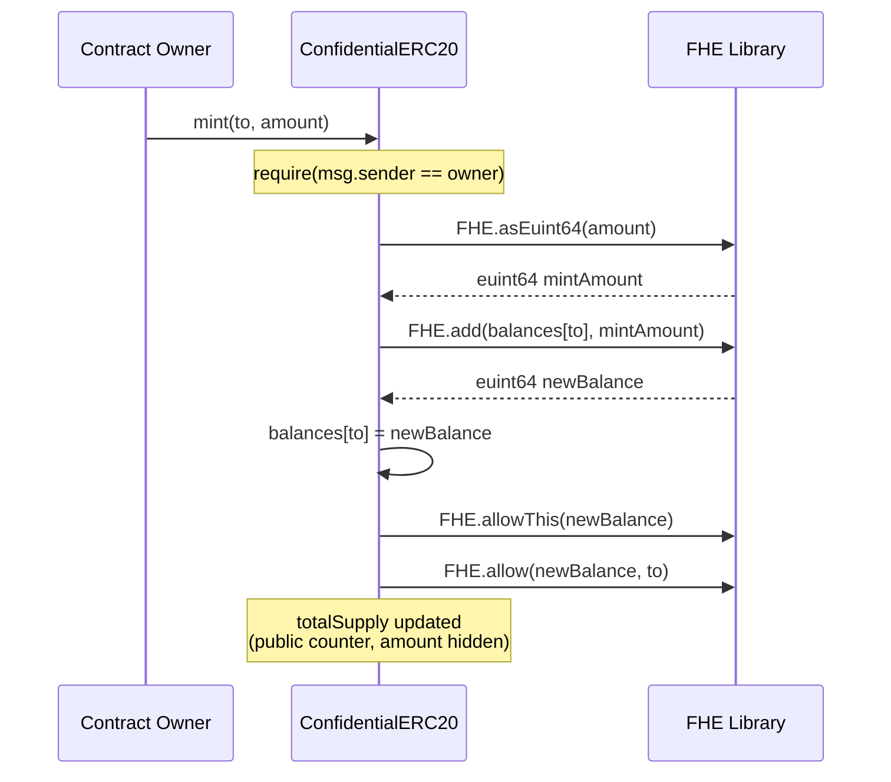

# Confidential ERC20 Token Transfer Flow

This diagram illustrates how a confidential ERC20 token transfer works under FHE. The critical design insight: the transaction **never reverts** on insufficient balance. Instead, it silently transfers zero, preserving the sender's balance privacy.

## Transfer Flow



## Privacy Comparison: Standard vs Confidential ERC20



## Mint Flow (Owner Only)



## Explanation

The `FHE.select` pattern is the core privacy technique:

```
ebool hasFunds = FHE.ge(senderBalance, amount);
euint64 transferAmount = FHE.select(hasFunds, amount, FHE.asEuint64(0));
```

This is equivalent to a ternary: `transferAmount = hasFunds ? amount : 0`

**Why not just revert?** Because a revert leaks information. If an observer sees a failed transaction, they learn the sender's balance is less than the attempted transfer amount. By always succeeding (transferring either the real amount or zero), no balance information leaks from transaction success/failure.

**What the public can see:**
- That a transfer transaction occurred
- The sender and recipient addresses
- Gas used

**What remains private:**
- The transfer amount
- Whether the transfer actually moved any tokens
- The sender's and recipient's balances
