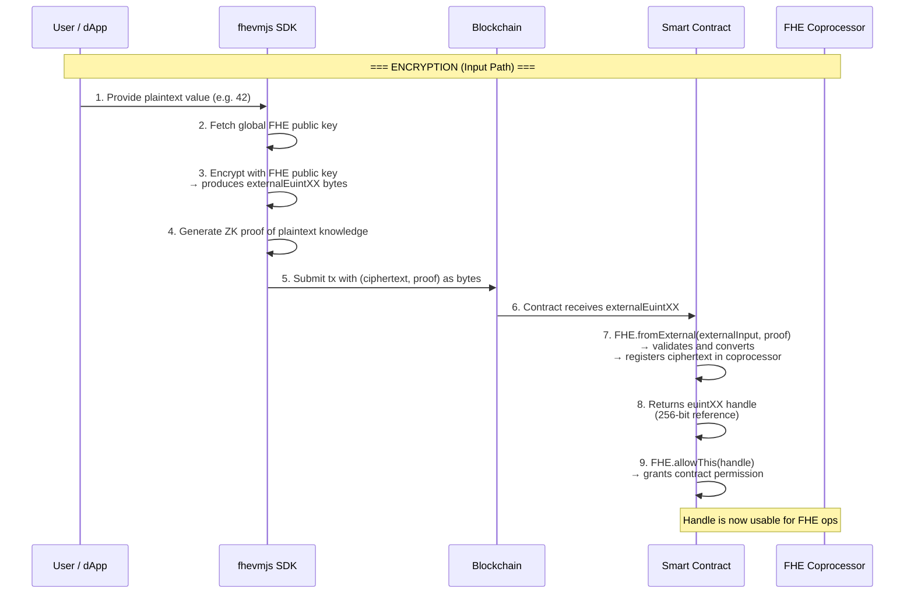
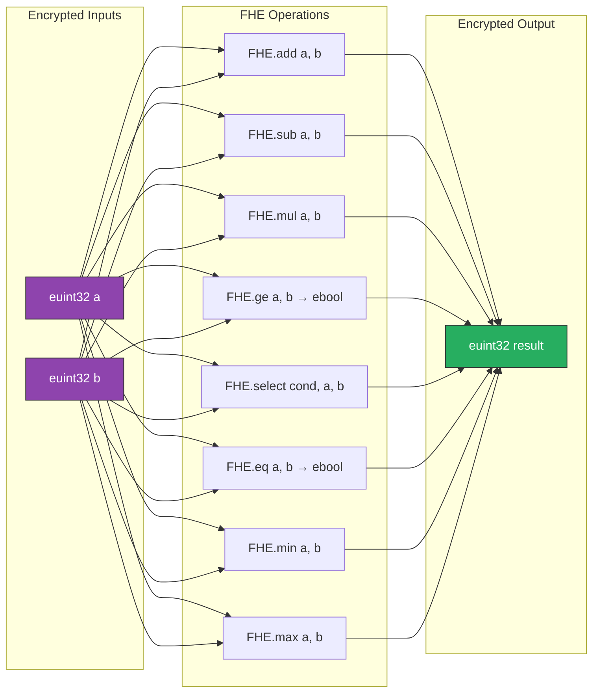
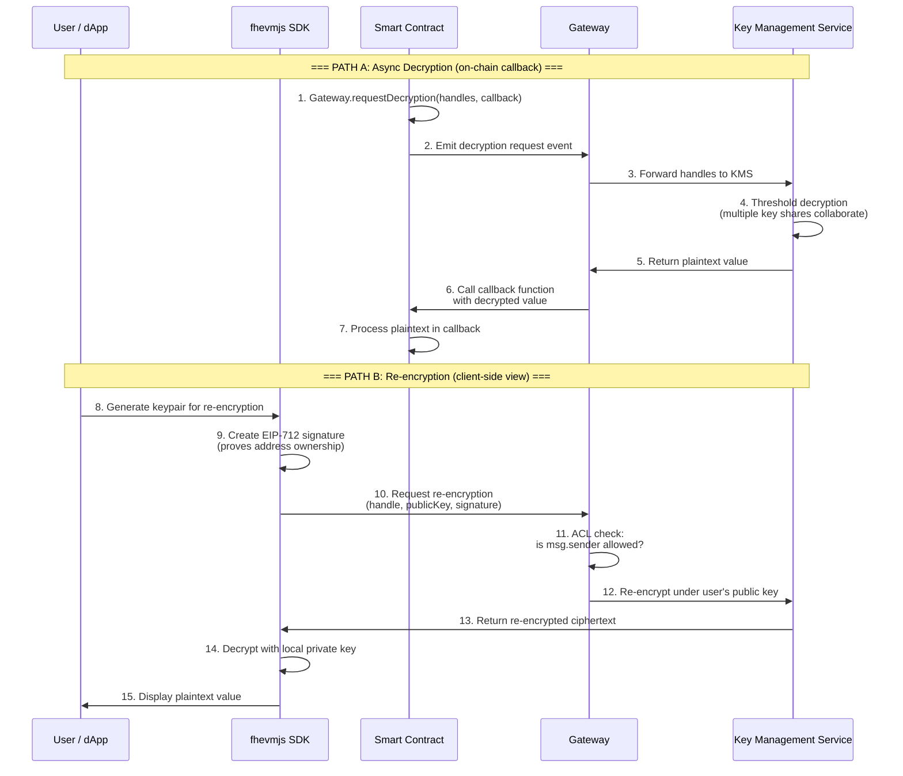

# Encryption and Decryption Data Flow

This diagram details the full lifecycle of encrypted data in fhEVM: from plaintext input through on-chain FHE operations, and back to plaintext output via two decryption paths.

## Encryption Flow (Input)

## FHE Operations (On-Chain)

## Decryption Flow (Output)

## Explanation

**Encryption** uses the network's global FHE public key. Anyone can encrypt, but only the coprocessor (via threshold KMS) can decrypt. A zero-knowledge proof accompanies each ciphertext to prove the encryptor knows the plaintext -- this prevents replay attacks.

**FHE Operations** are performed entirely on ciphertexts. The smart contract code reads like normal Solidity but operates on encrypted types. The coprocessor executes the actual homomorphic math.

**Decryption** has two paths:
- **Async Decryption** reveals values on-chain via a callback pattern. Used when the contract needs the plaintext (e.g., to emit an event or make a decision after voting ends).
- **Re-encryption** lets an authorized user view their own encrypted data without revealing it on-chain. The ciphertext is re-encrypted under the user's personal key and decrypted client-side.
