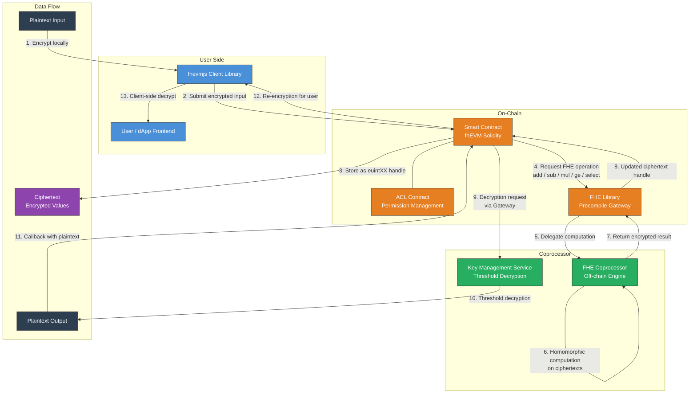

# FHE on Blockchain - High-Level Architecture

This diagram shows how Fully Homomorphic Encryption (FHE) enables confidential computation on a public blockchain. Data remains encrypted throughout its lifecycle on-chain, with a coprocessor handling the heavy FHE operations off-chain.

## Key Concepts

- **Ciphertext Handles:** On-chain, encrypted values are represented as 256-bit handles (`euint8`, `euint16`, `euint32`, `euint64`, etc.). The actual ciphertext lives in the coprocessor.
- **Coprocessor Architecture:** The blockchain node itself does not perform FHE math. A dedicated coprocessor receives operation requests via precompiles, executes them on the full ciphertexts, and returns new handles.
- **Key Management Service (KMS):** Decryption is a threshold process. No single party holds the full FHE secret key. Multiple KMS nodes must collaborate to decrypt, preventing any single point of trust.
- **ACL Gating:** Every ciphertext handle has an access control list. Only contracts and addresses explicitly granted permission can operate on or decrypt a given ciphertext.
