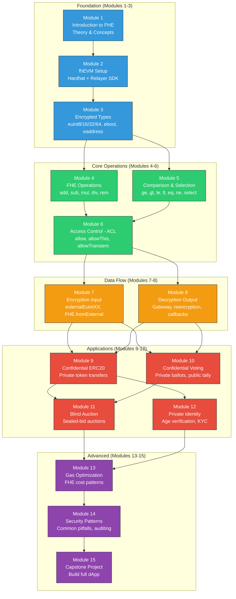
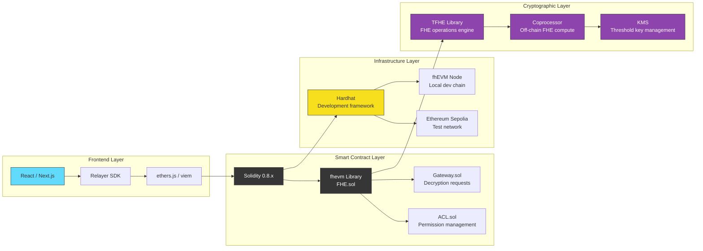

# FHEVM Bootcamp - Project & Curriculum Architecture

This diagram shows the overall structure of the 15-module bootcamp curriculum, organized by difficulty level with dependency arrows showing the recommended learning path.

## Curriculum Flow

## Project Directory Structure

```mermaid
graph TD
    ROOT[fhevm-bootcamp/] --> CONTRACTS[contracts/<br/>Solidity smart contracts]
    ROOT --> MODULES[modules/<br/>Learning material per module]
    ROOT --> EXERCISES[exercises/<br/>Hands-on coding tasks]
    ROOT --> SOLUTIONS[solutions/<br/>Reference implementations]
    ROOT --> TEST[test/<br/>Hardhat test suites]
    ROOT --> SCRIPTS[scripts/<br/>Deployment & interaction]
    ROOT --> CURRICULUM[curriculum/<br/>Curriculum planning docs]
    ROOT --> RESOURCES[resources/<br/>Reference materials]
    ROOT --> DIAGRAMS[diagrams/<br/>Architecture diagrams]
    ROOT --> CONFIG[Config Files<br/>hardhat.config.ts<br/>tsconfig.json<br/>package.json]

    CONTRACTS --> C_ERC20[ConfidentialERC20.sol]
    CONTRACTS --> C_VOTE[ConfidentialVoting.sol]
    CONTRACTS --> C_AUCTION[BlindAuction.sol]
    CONTRACTS --> C_ID[PrivateIdentity.sol]

    MODULES --> MOD1[module-01/ through<br/>module-15/]

    TEST --> T_ERC20[confidentialERC20.test.ts]
    TEST --> T_VOTE[voting.test.ts]
    TEST --> T_MORE[...]

    style ROOT fill:#2c3e50,stroke:#333,color:#fff
    style CONTRACTS fill:#e74c3c,stroke:#333,color:#fff
    style MODULES fill:#3498db,stroke:#333,color:#fff
    style TEST fill:#27ae60,stroke:#333,color:#fff
    style SCRIPTS fill:#f39c12,stroke:#333,color:#fff
```

## Technology Stack

## Difficulty Progression

```mermaid
graph LR
    subgraph Beginner
        B1[Theory]
        B2[Setup]
        B3[Types]
    end

    subgraph Intermediate
        I1[Operations]
        I2[Comparisons]
        I3[ACL]
        I4[Input/Output]
    end

    subgraph Advanced
        A1[Confidential ERC20]
        A2[Voting]
        A3[Blind Auction]
        A4[Private Identity]
    end

    subgraph Expert
        E1[Gas Optimization]
        E2[Security]
        E3[Capstone]
    end

    B1 --> B2 --> B3
    B3 --> I1 --> I2 --> I3 --> I4
    I4 --> A1 --> A2 --> A3 --> A4
    A4 --> E1 --> E2 --> E3

    style B1 fill:#3498db,stroke:#333,color:#fff
    style B2 fill:#3498db,stroke:#333,color:#fff
    style B3 fill:#3498db,stroke:#333,color:#fff
    style I1 fill:#2ecc71,stroke:#333,color:#fff
    style I2 fill:#2ecc71,stroke:#333,color:#fff
    style I3 fill:#2ecc71,stroke:#333,color:#fff
    style I4 fill:#2ecc71,stroke:#333,color:#fff
    style A1 fill:#e74c3c,stroke:#333,color:#fff
    style A2 fill:#e74c3c,stroke:#333,color:#fff
    style A3 fill:#e74c3c,stroke:#333,color:#fff
    style A4 fill:#e74c3c,stroke:#333,color:#fff
    style E1 fill:#8e44ad,stroke:#333,color:#fff
    style E2 fill:#8e44ad,stroke:#333,color:#fff
    style E3 fill:#8e44ad,stroke:#333,color:#fff
```

## Explanation

The bootcamp is structured as a progressive learning path:

1. **Foundation (Blue):** Understand what FHE is, set up the development environment, and learn the encrypted type system.
2. **Core Operations (Green):** Master arithmetic operations, comparison/selection patterns, and the critical ACL permission system.
3. **Data Flow (Orange):** Learn how data enters (encryption + proofs) and exits (decryption + re-encryption) the FHE system.
4. **Applications (Red):** Build real-world use cases: private tokens, confidential voting, sealed-bid auctions, and privacy-preserving identity.
5. **Advanced (Purple):** Optimize gas costs (FHE operations are expensive), learn security best practices, and build a complete capstone project combining everything learned.

Each module builds on previous ones. The dependency graph shows that modules can sometimes be studied in parallel (e.g., Modules 4 and 5 can be done in either order after Module 3).
