# FHEVM Bootcamp - Project & Curriculum Architecture

This diagram shows the overall structure of the 20-module bootcamp curriculum, organized by difficulty level with dependency arrows showing the recommended learning path.

## Curriculum Flow

```mermaid
graph TD
    subgraph "Foundation (Modules 00-02)"
        M1[Module 00<br/>Introduction to FHE<br/>Theory & Concepts]
        M2[Module 01<br/>fhEVM Setup<br/>Hardhat + Relayer SDK]
        M3[Module 02<br/>Encrypted Types<br/>euint8/16/32/64, ebool, eaddress]
    end

    subgraph "Core Operations (Modules 03-05)"
        M4[Module 03<br/>FHE Operations<br/>add, sub, mul, div, rem]
        M5[Module 04<br/>Comparison & Selection<br/>ge, gt, le, lt, eq, ne, select]
        M6[Module 05<br/>Access Control - ACL<br/>allow, allowThis, allowTransient]
    end

    subgraph "Data Flow (Modules 06-07)"
        M7[Module 06<br/>Encryption Input<br/>externalEuintXX, FHE.fromExternal]
        M8[Module 07<br/>Decryption Output<br/>Gateway, reencryption, callbacks]
    end

    subgraph "Applications (Modules 08-13)"
        M9[Module 08<br/>Conditional Logic<br/>Encrypted branching]
        M10[Module 09<br/>Random Number Generation<br/>On-chain FHE randomness]
        M11[Module 10<br/>Frontend Integration<br/>Relayer SDK + UI]
        M12[Module 11<br/>Confidential ERC20<br/>Private token transfers]
        M13[Module 12<br/>Confidential Voting<br/>Private ballots, public tally]
        M14[Module 13<br/>Blind Auction<br/>Sealed-bid auctions]
    end

    subgraph "Testing & Optimization (Modules 14-16)"
        M15[Module 14<br/>Testing & Debugging<br/>FHE test patterns]
        M16[Module 15<br/>Gas Optimization<br/>FHE cost patterns]
        M17[Module 16<br/>Security<br/>Common pitfalls, auditing]
    end

    subgraph "Expert (Modules 17-19)"
        M18[Module 17<br/>Advanced Patterns<br/>Complex FHE architectures]
        M19[Module 18<br/>Confidential DeFi<br/>Private DeFi protocols]
        M20[Module 19<br/>Capstone Project<br/>Build full dApp]
    end

    M1 --> M2
    M2 --> M3
    M3 --> M4
    M3 --> M5
    M4 --> M6
    M5 --> M6
    M6 --> M7
    M6 --> M8
    M7 --> M9
    M8 --> M9
    M7 --> M10
    M8 --> M10
    M9 --> M11
    M10 --> M11
    M11 --> M12
    M12 --> M13
    M13 --> M14
    M14 --> M15
    M15 --> M16
    M16 --> M17
    M17 --> M18
    M18 --> M19
    M19 --> M20

    style M1 fill:#3498db,stroke:#333,color:#fff
    style M2 fill:#3498db,stroke:#333,color:#fff
    style M3 fill:#3498db,stroke:#333,color:#fff
    style M4 fill:#2ecc71,stroke:#333,color:#fff
    style M5 fill:#2ecc71,stroke:#333,color:#fff
    style M6 fill:#2ecc71,stroke:#333,color:#fff
    style M7 fill:#f39c12,stroke:#333,color:#fff
    style M8 fill:#f39c12,stroke:#333,color:#fff
    style M9 fill:#e74c3c,stroke:#333,color:#fff
    style M10 fill:#e74c3c,stroke:#333,color:#fff
    style M11 fill:#e74c3c,stroke:#333,color:#fff
    style M12 fill:#e74c3c,stroke:#333,color:#fff
    style M13 fill:#e74c3c,stroke:#333,color:#fff
    style M14 fill:#e74c3c,stroke:#333,color:#fff
    style M15 fill:#9b59b6,stroke:#333,color:#fff
    style M16 fill:#9b59b6,stroke:#333,color:#fff
    style M17 fill:#9b59b6,stroke:#333,color:#fff
    style M18 fill:#8e44ad,stroke:#333,color:#fff
    style M19 fill:#8e44ad,stroke:#333,color:#fff
    style M20 fill:#8e44ad,stroke:#333,color:#fff
```

## Project Directory Structure

## Technology Stack

## Difficulty Progression

```mermaid
graph LR
    subgraph Beginner
        B1[Theory]
        B2[Setup]
        B3[Types]
    end

    subgraph Intermediate
        I1[Operations]
        I2[Comparisons]
        I3[ACL]
        I4[Input/Output]
    end

    subgraph Applications
        AP1[Conditional]
        AP2[Random]
        AP3[Frontend]
        AP4[ERC20]
        AP5[Voting]
        AP6[Auction]
    end

    subgraph Advanced
        AD1[Testing]
        AD2[Gas Optimization]
        AD3[Security]
    end

    subgraph Expert
        E1[Advanced Patterns]
        E2[Confidential DeFi]
        E3[Capstone]
    end

    B1 --> B2 --> B3
    B3 --> I1 --> I2 --> I3 --> I4
    I4 --> AP1 --> AP2 --> AP3 --> AP4 --> AP5 --> AP6
    AP6 --> AD1 --> AD2 --> AD3
    AD3 --> E1 --> E2 --> E3

    style B1 fill:#3498db,stroke:#333,color:#fff
    style B2 fill:#3498db,stroke:#333,color:#fff
    style B3 fill:#3498db,stroke:#333,color:#fff
    style I1 fill:#2ecc71,stroke:#333,color:#fff
    style I2 fill:#2ecc71,stroke:#333,color:#fff
    style I3 fill:#2ecc71,stroke:#333,color:#fff
    style I4 fill:#2ecc71,stroke:#333,color:#fff
    style AP1 fill:#e74c3c,stroke:#333,color:#fff
    style AP2 fill:#e74c3c,stroke:#333,color:#fff
    style AP3 fill:#e74c3c,stroke:#333,color:#fff
    style AP4 fill:#e74c3c,stroke:#333,color:#fff
    style AP5 fill:#e74c3c,stroke:#333,color:#fff
    style AP6 fill:#e74c3c,stroke:#333,color:#fff
    style AD1 fill:#9b59b6,stroke:#333,color:#fff
    style AD2 fill:#9b59b6,stroke:#333,color:#fff
    style AD3 fill:#9b59b6,stroke:#333,color:#fff
    style E1 fill:#8e44ad,stroke:#333,color:#fff
    style E2 fill:#8e44ad,stroke:#333,color:#fff
    style E3 fill:#8e44ad,stroke:#333,color:#fff
```

## Explanation

The bootcamp is structured as a progressive 20-module learning path:

1. **Foundation (Blue, Modules 00-02):** Understand what FHE is, set up the development environment, and learn the encrypted type system.
2. **Core Operations (Green, Modules 03-05):** Master arithmetic operations, comparison/selection patterns, and the critical ACL permission system.
3. **Data Flow (Orange, Modules 06-07):** Learn how data enters (encryption + proofs) and exits (decryption + re-encryption) the FHE system.
4. **Applications (Red, Modules 08-13):** Build real-world use cases: conditional logic, random number generation, frontend integration, private tokens, confidential voting, and sealed-bid auctions.
5. **Testing & Optimization (Light Purple, Modules 14-16):** Learn FHE testing patterns, optimize gas costs (FHE operations are expensive), and understand security best practices and common pitfalls.
6. **Expert (Dark Purple, Modules 17-19):** Master advanced FHE architectural patterns, build confidential DeFi protocols, and complete a capstone project combining everything learned.

Each module builds on previous ones. The dependency graph shows that modules can sometimes be studied in parallel (e.g., Modules 03 and 04 can be done in either order after Module 02).
