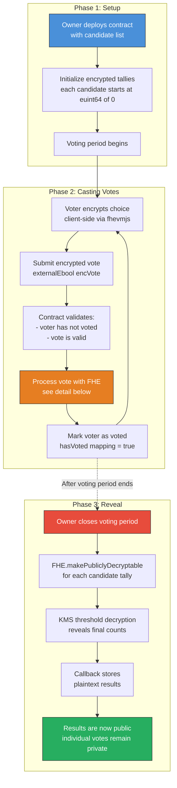
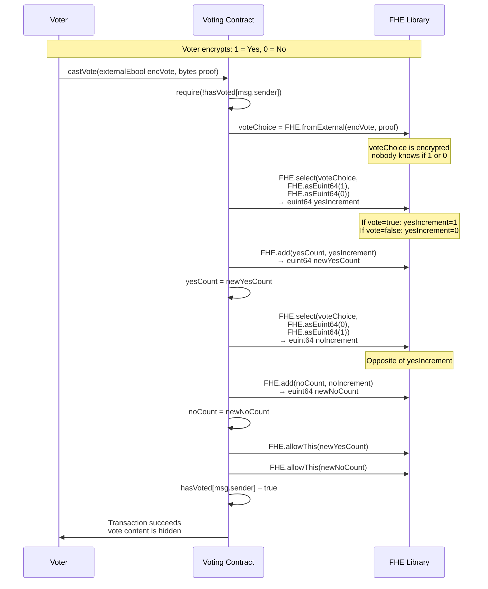
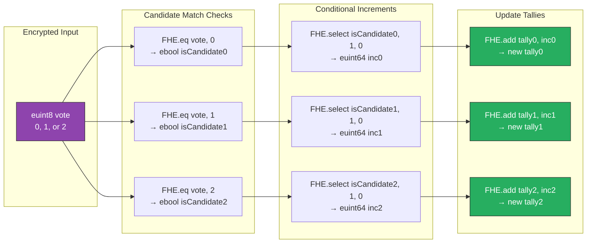
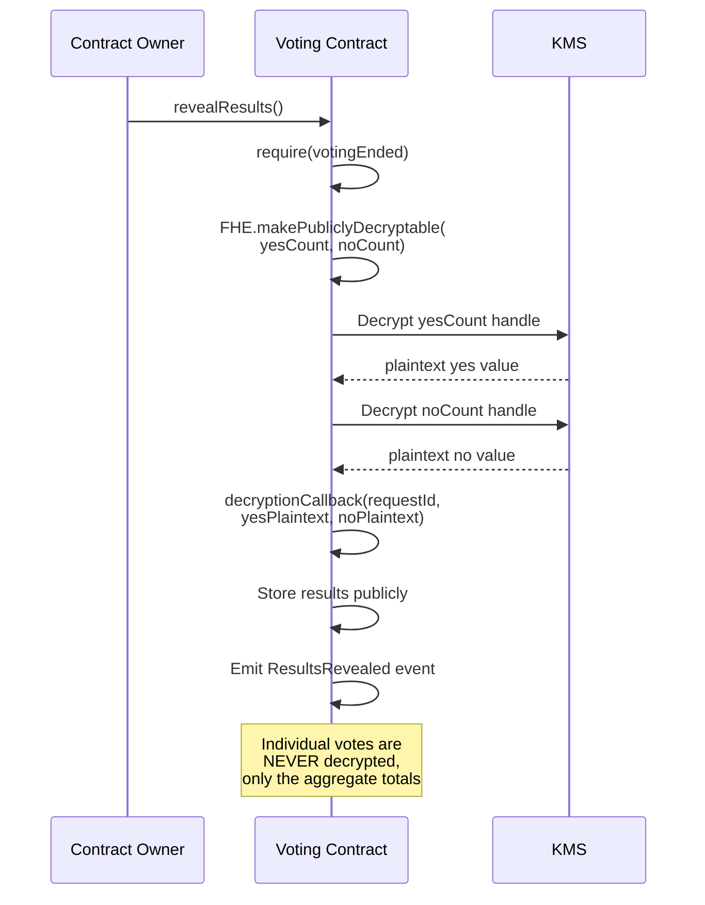

# Confidential Voting System Flow

This diagram shows how FHE enables a voting system where individual votes remain private, yet the final tally can be revealed. No one -- not even the contract owner -- can see how any individual voted.

## Voting Lifecycle

## Vote Processing Detail (Yes/No Example)

## Multi-Candidate Vote Processing

## Reveal Phase

## Explanation

**Privacy guarantees:**
- No one can see any individual vote, not even the contract owner or validators
- During voting, even the running tally is encrypted
- Only the final aggregate is revealed after voting ends
- The act of voting is public (addresses are visible), but the vote content is private

**The FHE.select pattern** is used again here, similar to the confidential ERC20. Instead of branching (which would leak information via gas differences), we compute both paths and select the result, keeping the execution path uniform regardless of the vote value.

**Multi-candidate extension:** For N candidates, the contract checks `FHE.eq(vote, i)` for each candidate i, then conditionally increments each tally. Only the matching tally gets +1, but all operations execute regardless, hiding which candidate received the vote.
