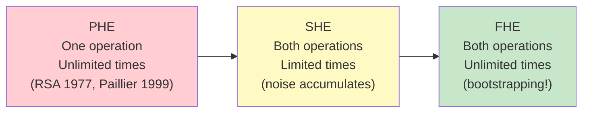
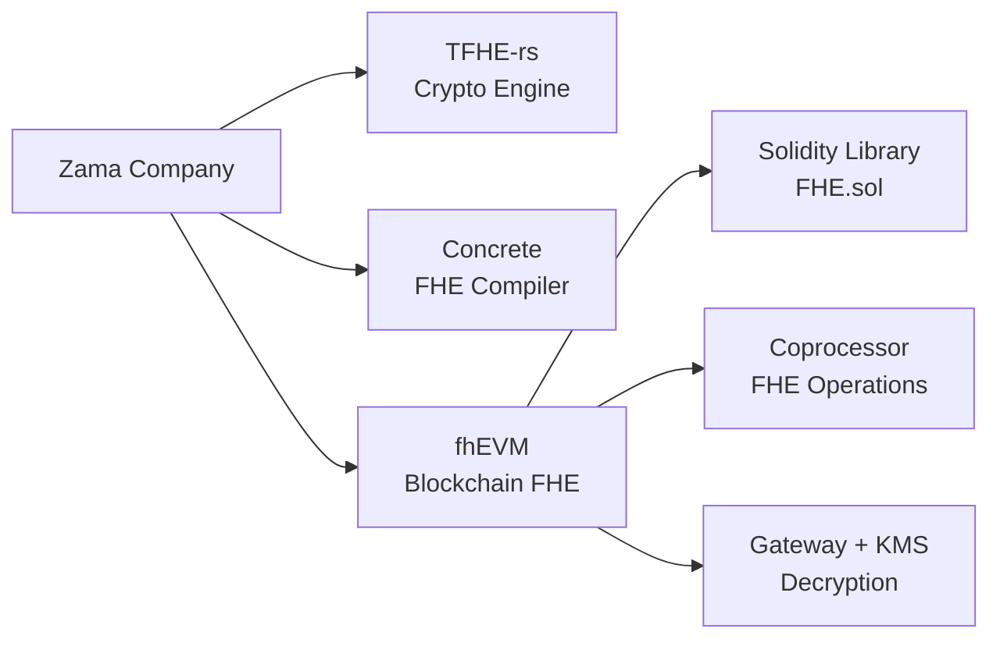
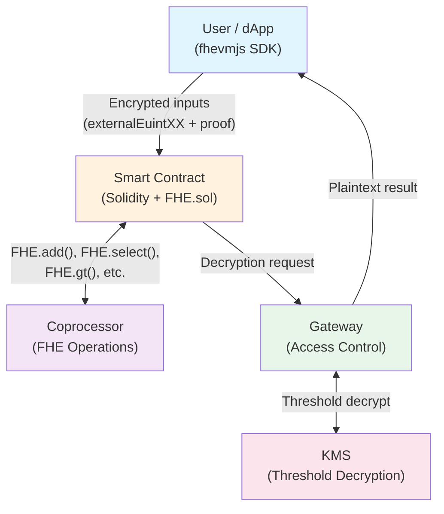
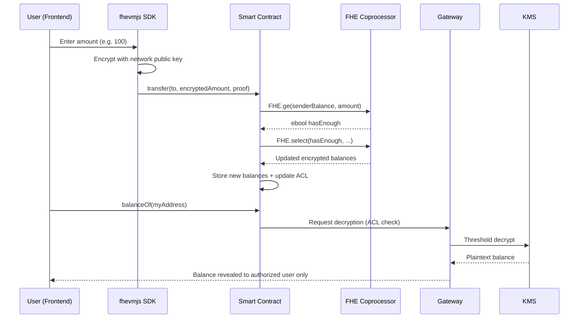

# Module 01 - Lesson: Introduction to Fully Homomorphic Encryption

---

## Table of Contents

1. [Encryption Fundamentals](#1-encryption-fundamentals)
2. [What is Homomorphic Encryption?](#2-what-is-homomorphic-encryption)
3. [Types of Homomorphic Encryption](#3-types-of-homomorphic-encryption)
4. [TFHE -- Torus Fully Homomorphic Encryption](#4-tfhe----torus-fully-homomorphic-encryption)
5. [The Privacy Problem on Blockchain](#5-the-privacy-problem-on-blockchain)
6. [Privacy Solutions Compared](#6-privacy-solutions-compared)
7. [What is fhEVM?](#7-what-is-fhevm)
8. [fhEVM Architecture](#8-fhevm-architecture)
9. [Use Cases](#9-use-cases)
10. [Summary](#10-summary)

---

## 1. Encryption Fundamentals

Before diving into homomorphic encryption, let us review the two fundamental categories of encryption.

### 1.1 Symmetric Encryption

In symmetric encryption, the **same key** is used for both encryption and decryption.

```
Plaintext  --[Key]--> Ciphertext  --[Key]--> Plaintext
```

**Example:** AES (Advanced Encryption Standard)

- Fast and efficient
- Challenge: How do you securely share the key?
- Use case: Encrypting data at rest, disk encryption, TLS session keys

### 1.2 Asymmetric Encryption

In asymmetric encryption, two different keys are used: a **public key** for encryption and a **private key** for decryption.

```
Plaintext  --[Public Key]--> Ciphertext  --[Private Key]--> Plaintext
```

**Example:** RSA, Elliptic Curve Cryptography (ECC)

- Solves the key distribution problem
- Slower than symmetric encryption
- Use case: HTTPS, digital signatures, blockchain wallets

### 1.3 The Limitation of Traditional Encryption

With traditional encryption, if you want to perform any computation on encrypted data, you must:

1. Decrypt the data first
2. Perform the computation on the plaintext
3. Re-encrypt the result

This means that **whoever performs the computation must have access to the plaintext data**. This is a fundamental problem for privacy in cloud computing, blockchain, and any scenario where computation is delegated to an untrusted party.

---

## 2. What is Homomorphic Encryption?

**Homomorphic Encryption (HE)** is a form of encryption that allows computations to be performed directly on encrypted data, without ever decrypting it. The result of the computation, when decrypted, is identical to the result of performing the same computation on the plaintext.

### 2.1 The Locked Ballot Box Analogy

Imagine a voting scenario:

1. Each voter writes their vote on a slip of paper and places it inside a **locked box** (encryption).
2. The election authority can **shake, weigh, or manipulate** the locked boxes to tally the votes (computation on ciphertext) -- without ever opening them.
3. At the end, a single trusted authority **unlocks the final result** (decryption) and announces the outcome.

At no point did anyone see an individual vote. Yet the final tally is mathematically correct.

### 2.2 Formal Definition

For an encryption scheme `E` and a computation `f`:

```
E(f(a, b)) = f(E(a), E(b))
```

In other words: encrypting the result of a computation is the same as computing on the encrypted values and then decrypting.

### 2.3 A Simple Illustration

Suppose we have an encryption scheme that supports addition:

```
Encrypt(5) = X
Encrypt(3) = Y

X + Y = Z  (computed on ciphertexts, never decrypted)

Decrypt(Z) = 8  (same as 5 + 3)
```

The server that computed `X + Y` never learned the values 5, 3, or 8.

---

## 3. Types of Homomorphic Encryption

Not all homomorphic encryption schemes are created equal. They differ in which operations they support and how many times those operations can be applied.

### 3.1 Partially Homomorphic Encryption (PHE)

PHE supports **one type of operation** (either addition or multiplication) an **unlimited** number of times.

| Scheme   | Operation      | Year |
|----------|---------------|------|
| RSA      | Multiplication | 1977 |
| Paillier | Addition       | 1999 |
| ElGamal  | Multiplication | 1985 |

**Limitation:** You cannot combine addition and multiplication, which means you cannot evaluate arbitrary functions.

### 3.2 Somewhat Homomorphic Encryption (SHE)

SHE supports **both addition and multiplication**, but only for a **limited number of operations**. Each operation introduces noise into the ciphertext. After too many operations, the noise overwhelms the signal and decryption fails.

Think of it like a photocopy of a photocopy -- each generation degrades quality.

### 3.3 Fully Homomorphic Encryption (FHE)

FHE supports **both addition and multiplication** for an **unlimited number of operations**. It achieves this through a technique called **bootstrapping**, which periodically "refreshes" the ciphertext to reduce noise.

```
+-------------------+------------+--------------+------------------+
| Type              | Operations | # Operations | Arbitrary Funcs? |
+-------------------+------------+--------------+------------------+
| PHE               | One        | Unlimited    | No               |
| SHE               | Both       | Limited      | No               |
| FHE               | Both       | Unlimited    | Yes              |
+-------------------+------------+--------------+------------------+
```



### 3.4 Historical Timeline

- **1978:** Rivest, Adleman, and Dertouzos propose the idea of computing on encrypted data.
- **2009:** Craig Gentry publishes the first FHE construction (lattice-based). It was groundbreaking but extremely slow -- a single operation took minutes.
- **2016:** TFHE scheme published by Chillotti, Gama, Georgieva, and Izabachene, enabling fast bootstrapped gate-by-gate evaluation.
- **2022:** Zama releases the fhEVM, bringing FHE to Solidity smart contracts.

---

## 4. TFHE -- Torus Fully Homomorphic Encryption

### 4.1 What is TFHE?

TFHE (Torus Fully Homomorphic Encryption) is a specific FHE scheme that operates over the **torus** -- a mathematical structure that can be visualized as the interval [0, 1) where the endpoints wrap around (like a clock).

### 4.2 Why TFHE?

Among the various FHE schemes (BGV, BFV, CKKS, TFHE), TFHE has several advantages that make it ideal for blockchain:

| Property | TFHE Advantage |
|----------|---------------|
| **Bootstrapping speed** | Very fast bootstrapping (milliseconds per gate), enabling practical computation |
| **Boolean and integer operations** | Natively supports operations on individual bits and small integers |
| **Exact arithmetic** | No approximation errors (unlike CKKS which works with approximate numbers) |
| **Programmable bootstrapping** | Can evaluate a lookup table during bootstrapping itself |

### 4.3 How TFHE Works (High Level)

1. **Encryption:** A plaintext value is encoded as a point on the torus, then noise is added to hide it. The noisy point is the ciphertext.
2. **Computation:** Homomorphic operations (addition, multiplication, comparisons) are performed on the ciphertexts. Each operation increases the noise level.
3. **Bootstrapping:** When noise gets too high, a special procedure "refreshes" the ciphertext, reducing noise back to a manageable level. This is the key innovation that makes FHE practical.
4. **Decryption:** The private key is used to remove the noise and recover the original plaintext result.

### 4.4 Supported Data Types in Zama's TFHE Library

Zama's TFHE library for fhEVM provides encrypted equivalents of common Solidity types:

| Plaintext Type | Encrypted Type | Description |
|---------------|---------------|-------------|
| `bool`   | `ebool`   | Encrypted boolean |
| `uint4`  | `euint4`  | Encrypted 4-bit unsigned integer |
| `uint8`  | `euint8`  | Encrypted 8-bit unsigned integer |
| `uint16` | `euint16` | Encrypted 16-bit unsigned integer |
| `uint32` | `euint32` | Encrypted 32-bit unsigned integer |
| `uint64` | `euint64` | Encrypted 64-bit unsigned integer |
| `uint128`| `euint128`| Encrypted 128-bit unsigned integer |
| `uint256`| `euint256`| Encrypted 256-bit unsigned integer |
| `address`| `eaddress`| Encrypted address |
| `bytes`  | `ebytes64`, `ebytes128`, `ebytes256` | Encrypted byte arrays |

---

## 5. The Privacy Problem on Blockchain

### 5.1 Everything is Public

Public blockchains like Ethereum are radically transparent by design. Every transaction, every state variable, every function call is visible to everyone. While this transparency enables trustlessness and auditability, it creates serious privacy problems.

### 5.2 What is Exposed?

| Data | Visibility | Problem |
|------|-----------|---------|
| **Token balances** | Fully public | Anyone can see how much you own |
| **Transaction history** | Fully public | All transfers are traceable |
| **DeFi positions** | Fully public | Liquidation levels, strategies visible to competitors |
| **Voting choices** | Fully public | No secret ballot possible |
| **Bids in auctions** | Fully public | Front-running and manipulation |
| **Medical/identity data** | Cannot store | Regulation prevents public health data |
| **Smart contract state** | Fully public | Even `private` variables are readable from storage |

### 5.3 Real Consequences

**Front-running:** In DeFi, when you submit a large swap transaction, bots can see it in the mempool, place a trade ahead of yours to move the price, and profit at your expense. This is called MEV (Maximal Extractable Value) and costs users billions of dollars per year.

**No secret voting:** On-chain governance votes are visible as they are cast, creating social pressure and enabling vote buying.

**Business confidentiality:** A company cannot use a public blockchain for payroll, supply chain, or competitive bidding without exposing sensitive data to competitors.

### 5.4 The `private` Keyword Misconception

A common misconception among new Solidity developers:

```solidity
uint256 private secretNumber = 42;
```

The `private` keyword in Solidity only prevents **other contracts** from reading the variable. Anyone can read it directly from the blockchain's storage slots using tools like `eth_getStorageAt`. **There is no data privacy on a public blockchain by default.**

---

## 6. Privacy Solutions Compared

Several cryptographic approaches attempt to solve blockchain privacy. Each has different trade-offs.

### 6.1 Zero-Knowledge Proofs (ZK-Proofs)

**What it does:** Proves that a statement is true without revealing the underlying data.

**Example:** "I can prove I have more than 100 tokens without telling you my exact balance."

**Strengths:**
- Well-researched, production-ready (zkSync, Starknet, Aztec)
- Can provide both privacy and scalability (ZK-Rollups)

**Limitations:**
- Proves properties about data, but does not enable computation on hidden data
- Complex circuit design required for each computation
- Cannot hide state from the smart contract itself -- the contract cannot compute on data it cannot see

### 6.2 Multi-Party Computation (MPC)

**What it does:** Multiple parties jointly compute a function over their inputs without revealing those inputs to each other.

**Example:** Three employees compute their average salary without any individual learning the others' salaries.

**Strengths:**
- No single point of trust
- Mature research area

**Limitations:**
- Requires communication between all parties during computation (high latency)
- Scales poorly with the number of parties
- Not practical for on-chain computation

### 6.3 Trusted Execution Environments (TEE)

**What it does:** Uses special hardware (like Intel SGX or ARM TrustZone) to create an isolated "enclave" where data is processed in plaintext but protected from the host system.

**Example:** A cloud server processes your medical records inside an enclave. Even the server administrator cannot read the data.

**Strengths:**
- Very fast -- data is processed in plaintext inside the enclave
- Relatively simple to implement

**Limitations:**
- Requires trust in the hardware manufacturer
- History of side-channel attacks (Spectre, Meltdown, SGX-specific attacks)
- Single point of failure if the hardware is compromised

### 6.4 Fully Homomorphic Encryption (FHE)

**What it does:** Allows arbitrary computation directly on encrypted data. The data remains encrypted throughout the entire computation.

**Example:** A smart contract can compare two encrypted bids, determine the winner, and update encrypted balances -- all without ever seeing the actual values.

**Strengths:**
- Strongest privacy guarantee: data is never decrypted during computation
- No hardware trust assumptions
- Composable: encrypted outputs can be inputs to further computations

**Limitations:**
- Computationally expensive (10x-1000x overhead compared to plaintext)
- Requires careful key management
- Still maturing in terms of developer tooling

### 6.5 Comparison Table

```
+------------------+------------------+------------------+------------------+------------------+
| Property         | ZK-Proofs        | MPC              | TEE              | FHE              |
+------------------+------------------+------------------+------------------+------------------+
| Data hidden      | From verifier    | From each party  | From host        | From everyone    |
| during compute?  |                  |                  |                  |                  |
+------------------+------------------+------------------+------------------+------------------+
| Compute on       | No (proves       | Yes (jointly)    | Yes (in enclave) | Yes (on cipher)  |
| hidden data?     | properties)      |                  |                  |                  |
+------------------+------------------+------------------+------------------+------------------+
| Hardware trust?  | No               | No               | Yes              | No               |
+------------------+------------------+------------------+------------------+------------------+
| Performance      | Fast (verify)    | Medium           | Fast             | Slow             |
|                  | Slow (prove)     |                  |                  |                  |
+------------------+------------------+------------------+------------------+------------------+
| Composability    | Limited          | Limited          | Full             | Full             |
+------------------+------------------+------------------+------------------+------------------+
| On-chain ready?  | Yes (ZK-Rollups) | Partial          | Partial          | Yes (fhEVM)      |
+------------------+------------------+------------------+------------------+------------------+
| Maturity         | High             | Medium           | Medium           | Growing          |
+------------------+------------------+------------------+------------------+------------------+
```

### 6.6 Can They Work Together?

These technologies are not mutually exclusive. In fact, fhEVM combines FHE with ZK-Proofs:

- **FHE** handles the confidential computation.
- **ZK-Proofs** are used to verify that inputs are well-formed and that the computation was performed correctly, without revealing the encrypted data.

---

## 7. What is fhEVM?

### 7.0 About Zama

**Zama** is a cryptography company founded in **2020** by **Rand Hindi** (CEO) and **Pascal Paillier** (CTO), headquartered in **Paris, France**. Zama's mission is to make homomorphic encryption accessible to developers across all platforms.

**Key facts:**
- **Founded:** 2020, Paris, France
- **Funding:** Over $70M raised (Series A led by Multicoin Capital and Protocol Labs, 2024)
- **Team:** 70+ researchers and engineers, including world-leading cryptographers
- **Open source:** All core libraries (TFHE-rs, Concrete, fhEVM) are open-source under BSD license
- **Products:**
  - **TFHE-rs** - Pure Rust implementation of the TFHE scheme (the cryptographic engine)
  - **Concrete** - FHE compiler for Python/ML workloads
  - **fhEVM** - FHE for Ethereum smart contracts (what this bootcamp teaches)
  - **fhEVM Coprocessor** - Off-chain FHE computation engine for blockchain

**Why Zama matters for blockchain:**

Zama is the first company to make FHE practical for smart contracts. Before fhEVM, there was no way for Solidity developers to write confidential on-chain logic without trusting hardware (TEE) or specialized circuits (ZK). Zama's fhEVM runs on **Ethereum Sepolia** (testnet) and **Ethereum Mainnet**, using a coprocessor architecture that keeps the EVM familiar while adding encrypted computation.



### 7.1 Definition

**fhEVM** is an open-source framework developed by Zama that brings Fully Homomorphic Encryption to the Ethereum Virtual Machine. It allows Solidity developers to write smart contracts that operate on encrypted data using a familiar syntax.

### 7.2 The Key Insight

Traditional blockchain: `Smart Contract computes on PLAINTEXT --> Everyone sees everything`

fhEVM blockchain: `Smart Contract computes on CIPHERTEXT --> Nobody sees anything (except authorized parties)`

With fhEVM, you replace standard Solidity types with their encrypted equivalents and use FHE-specific operators. The contract logic remains in Solidity, but the data it processes is encrypted end-to-end.

### 7.3 What Changes for Developers?

| Standard Solidity | fhEVM Solidity |
|-------------------|----------------|
| `uint256 balance` | `euint64 balance` |
| `balance >= amount` | `FHE.le(amount, balance)` |
| `balance -= amount` | `balance = FHE.sub(balance, amount)` |
| `if (condition) {...}` | `FHE.select(condition, valueIfTrue, valueIfFalse)` |
| Anyone can read `balance` | Only authorized addresses can decrypt `balance` |

### 7.4 What Does NOT Change?

- You still write Solidity.
- You still deploy to an EVM-compatible chain.
- You still use Hardhat/Foundry for development.
- You still interact with contracts via ethers.js/wagmi.
- Gas is still paid in the native token.

---

## 8. fhEVM Architecture

The fhEVM ecosystem consists of four main components that work together to enable confidential smart contracts.

### 8.1 Architecture Overview

```
    +-------------------+
    |   User / dApp     |
    |  (Frontend + SDK) |
    +--------+----------+
             |
             | Encrypted inputs
             v
    +-------------------+        +-------------------+
    |  Smart Contract   |<------>|   Coprocessor     |
    |  Layer (EVM)      |        |   (FHE Engine)    |
    +--------+----------+        +-------------------+
             |
             | Decryption requests
             v
    +-------------------+        +-------------------+
    |     Gateway       |<------>|       KMS         |
    | (Access Control)  |        | (Key Management)  |
    +-------------------+        +-------------------+
```

**Mermaid diagram (for GitHub rendering):**



### 8.2 Smart Contract Layer

This is the familiar EVM execution environment. Smart contracts are written in Solidity using Zama's `fhevm` library. They contain encrypted state variables (`euint64`, `ebool`, etc.) and call FHE operations via the `FHE` library.

**Key points:**
- Contracts look like normal Solidity, with encrypted types and FHE operations.
- The EVM itself does not perform the FHE computations -- it delegates them.
- Encrypted values are stored on-chain as ciphertext handles (references to ciphertexts managed by the coprocessor).

### 8.3 Coprocessor

The coprocessor is the computational engine that performs the actual FHE operations. When a smart contract calls `FHE.add(a, b)`, the EVM delegates the heavy cryptographic computation to the coprocessor.

**Key points:**
- Performs all FHE operations: addition, subtraction, multiplication, comparison, bitwise operations, shifts, etc.
- Handles bootstrapping to refresh ciphertexts and maintain correctness.
- Runs off-chain but produces results that are verifiable on-chain.
- This is where the computational overhead of FHE is absorbed.

### 8.4 Gateway

The Gateway is the access control layer that mediates decryption requests. When an authorized party wants to decrypt a value, the request goes through the Gateway.

**Key points:**
- Enforces on-chain access control: only addresses explicitly authorized by the contract can request decryption.
- Acts as an intermediary between the blockchain and the KMS.
- Supports both synchronous (callback-based) and asynchronous decryption patterns.
- Prevents unauthorized access to plaintext values.

### 8.5 KMS (Key Management Service)

The KMS is a distributed threshold decryption service that holds the global FHE secret key in a secure, distributed manner.

**Key points:**
- The global FHE key is split across multiple parties using threshold cryptography.
- No single party can decrypt data on their own.
- Decryption requires a threshold number of parties to cooperate.
- The KMS only decrypts values when authorized by the Gateway (which checks on-chain permissions).

### 8.6 Data Flow Example: Encrypted Token Transfer



Here is what happens when a user transfers encrypted tokens:

1. **User encrypts input:** The user encrypts the transfer amount client-side using the network's public FHE key and submits the transaction.
2. **Contract receives ciphertext:** The contract receives the encrypted amount as an `externalEuint64` and converts it to an `euint64` via `FHE.fromExternal()`.
3. **FHE computation:** The contract calls `FHE.le(amount, senderBalance)` to check if the sender has enough balance. The coprocessor performs this comparison on ciphertexts.
4. **Conditional update:** Using `FHE.select()`, the contract conditionally updates balances -- all while the actual values remain encrypted.
5. **Result stored:** The new encrypted balances are stored on-chain.
6. **Optional decryption:** If the user wants to see their balance, they request decryption through the Gateway, which checks ACL permissions and coordinates with the KMS.

---

## 9. Use Cases

FHE on blockchain unlocks entirely new categories of applications that were previously impossible due to the transparency of public chains.

### 9.1 Confidential DeFi

| Application | What FHE Enables |
|-------------|-----------------|
| **Private token transfers** | Transfer amounts are hidden; only sender and receiver know the value |
| **Dark pool trading** | Orders are matched without revealing prices or quantities |
| **Private lending** | Collateral ratios and loan amounts are confidential |
| **MEV protection** | Transaction details are encrypted, preventing front-running |
| **Private yield farming** | Strategy positions are hidden from competitors |

### 9.2 Private Voting

On-chain governance currently has a fundamental flaw: votes are public as they are cast, enabling:
- Social pressure and coercion
- Vote buying
- Strategic last-minute voting

With FHE:
- Each vote is encrypted. Nobody can see individual votes during the voting period.
- The smart contract tallies encrypted votes homomorphically.
- Only the final result is decrypted after the voting period ends.
- True secret ballot on-chain.

### 9.3 Sealed-Bid Auctions

In a traditional on-chain auction, all bids are visible. With FHE:
- Bidders submit encrypted bids.
- The contract compares encrypted bids to determine the winner.
- Only the winning bid amount is revealed.
- Losing bids remain confidential.

### 9.4 Confidential Gaming

| Game Type | Privacy Benefit |
|-----------|----------------|
| **Card games** | Players' hands are encrypted; the contract deals and evaluates hands without seeing them |
| **Strategy games** | Fog-of-war: players cannot see opponents' hidden units or resources |
| **Lottery/RNG** | Random numbers can be generated and used without revealing them prematurely |

### 9.5 Identity and Compliance

- **Private KYC:** A contract can verify "this user is over 18" or "this user is not on a sanctions list" without revealing the user's identity.
- **Soulbound tokens:** Credentials and attestations that are verifiable but not publicly readable.
- **Selective disclosure:** Users control exactly which attributes they reveal to which contracts.

### 9.6 Healthcare and Data Markets

- **Medical records:** Encrypted patient data can be processed by smart contracts for insurance, research, or referrals without exposing sensitive information.
- **Data marketplaces:** Buyers can verify data quality (by running computations on encrypted samples) before purchasing, without the seller revealing the data.

---

## 10. Real-World Milestones: FHE in Production

The concepts taught in this bootcamp are not just theoretical -- they are already powering production systems on Ethereum mainnet. This section covers the most significant real-world FHE milestones to date.

### 10.1 The $ZAMA Token and Encrypted ICO (January 2026)

In January 2026, Zama conducted the **first encrypted ICO on Ethereum** -- a confidential sealed-bid Dutch auction where bid amounts were encrypted using FHE. This was the first production-scale demonstration of FHE on Ethereum mainnet.

**How it worked (technically):**

The auction used a sealed-bid Dutch auction mechanism where:
1. Participants submitted bids with **public price** but **encrypted amounts**
2. The clearing price was calculated **homomorphically, directly on encrypted data**
3. No participant, bot, or organizer could see individual bid amounts
4. After the auction closed, only the aggregate results were decrypted

This is exactly the pattern you will learn in **Module 13 (Sealed-Bid Auctions)** -- but deployed at Ethereum mainnet scale.

**Auction Results (January 21-24, 2026):**

| Metric | Value |
|--------|-------|
| Total Value Shielded | $121.3M |
| Total Committed | $118.5M |
| Unique Bidders | 11,103 |
| Total Bids Executed | 24,697 |
| Clearing Price | $0.05 per ZAMA |
| Oversubscription | 218% (2.8B tokens demanded, 880M available) |
| Refund Ratio | 62.89% |

**Key achievement:** The Zama auction app became the **most-used application on Ethereum on January 24th** -- surpassing USDT, USDC, and Uniswap in transaction volume. It took only 3 days to reach $100M+ in Total Value Shielded, a milestone that took other privacy protocols years.

### 10.2 The $ZAMA Token

The $ZAMA token launched on **February 2, 2026** across major exchanges (Kraken, OKX, KuCoin, with Coinbase support pending).

**Token utility:**
- Pay for **encryption and decryption** operations on the Zama Protocol
- Reward **operators and stakers** for running and securing the network
- All fees are **burned**, while rewards follow a yearly emission schedule

**Contract addresses:**
- Ethereum: `0xa12cc123ba206d4031d1c7f6223d1c2ec249f4f3`

**Key resources:**
- Staking: staking.zama.org
- Bridge: bridge.zama.org

### 10.3 First Confidential USDT Transfer on Ethereum

With the mainnet launch, Zama completed the **first confidential USDT (cUSDT) transfer** on Ethereum -- proving that FHE can handle real-world token transfers at production scale. The protocol maintained zero downtime and kept up with Ethereum's throughput, proving FHE is production-ready for financial applications.

### 10.4 Zama Developer Program Winners

The Zama Developer Program has awarded **685 developers** across 6 seasons with **$106,000** in prizes. Here are notable winning projects that demonstrate real-world FHE applications:

| Project | Track | Prize | Description |
|---------|-------|-------|-------------|
| **Zama School** (MadeleineAguil) | Builder | $5,000 | Educational platform demonstrating FHE through interactive examples |
| **Hello FHE Tutorial** (realchriswilder) | Builder | $3,000 | Step-by-step guide for privacy-preserving dApps |
| **FHE Guessing Game** (NecipAkgz) | Bounty | $2,000 | Rock-Paper-Scissors game using Zama Protocol |
| **Agora** | Builder | - | Privacy-focused governance system |
| **AlphaEngine** | Builder | - | Uniswap V4 privacy hook integration |
| **Siphon Protocol** | Builder | - | DeFi privacy layer with FHE + ZK proofs |
| **Uniquity** | Builder | - | Privacy-first identity verification |
| **Encrypted Wordle** | Bounty | - | On-chain word game using FHE |

**Current tracks:**
- **Builder Track** ($10,000): Create complete end-to-end demo apps using fhEVM
- **Bounty Track** ($10,000): Build Hardhat-based fhEVM example repositories
- **Startup Track**: Rolling applications for FHE-based startups

Learn more and apply: [zama.org/developer-hub](https://www.zama.org/developer-hub)

### 10.5 Why This Matters for You

Every concept in this bootcamp maps directly to what was used in production:

| Bootcamp Module | Production Usage |
|-----------------|-----------------|
| Module 03: Encrypted Types | Encrypted bid amounts in the auction |
| Module 05: ACL | Controlling who can see bid data |
| Module 06: Encrypted Inputs | Users submitting encrypted bids |
| Module 08: Conditional Logic | Homomorphic clearing price calculation |
| Module 11: Confidential ERC-20 | Confidential USDT (cUSDT) transfers |
| Module 12: Private Voting | Sealed-bid mechanism (encrypted tallies) |
| Module 13: Sealed-Bid Auction | The entire auction mechanism |

By completing this bootcamp, you will have the skills to build applications like the ones that processed $121M in encrypted value on Ethereum mainnet.

---

## 11. Summary

### Key Concepts

| Concept | Definition |
|---------|-----------|
| **Homomorphic Encryption** | Encryption that allows computation on ciphertext |
| **PHE** | Supports one operation (add OR multiply), unlimited times |
| **SHE** | Supports both operations, limited number of times |
| **FHE** | Supports both operations, unlimited times (via bootstrapping) |
| **TFHE** | A specific FHE scheme based on torus math, used by Zama |
| **Bootstrapping** | Technique to reduce noise in ciphertexts, enabling unlimited operations |
| **fhEVM** | Zama's framework bringing FHE to the EVM via Solidity |
| **Coprocessor** | Performs the actual FHE computations off-chain |
| **Gateway** | Enforces access control for decryption requests |
| **KMS** | Distributed threshold decryption service |

### The Big Picture

Public blockchains solved the problem of **trust** -- you do not need to trust a central authority. But they created a problem of **privacy** -- everyone can see everything. FHE solves the privacy problem without sacrificing the trustlessness that makes blockchain valuable.

With fhEVM, Solidity developers can build applications that were previously impossible:
- Private DeFi that protects users from MEV
- True secret ballot voting
- Sealed-bid auctions
- Confidential identity verification
- Private gaming with hidden information

And they can do all of this using familiar Solidity syntax, deploying to an EVM-compatible chain.

---

**Next:** [Module 02 - fhEVM Development Setup](../02-development-setup/README.md)
