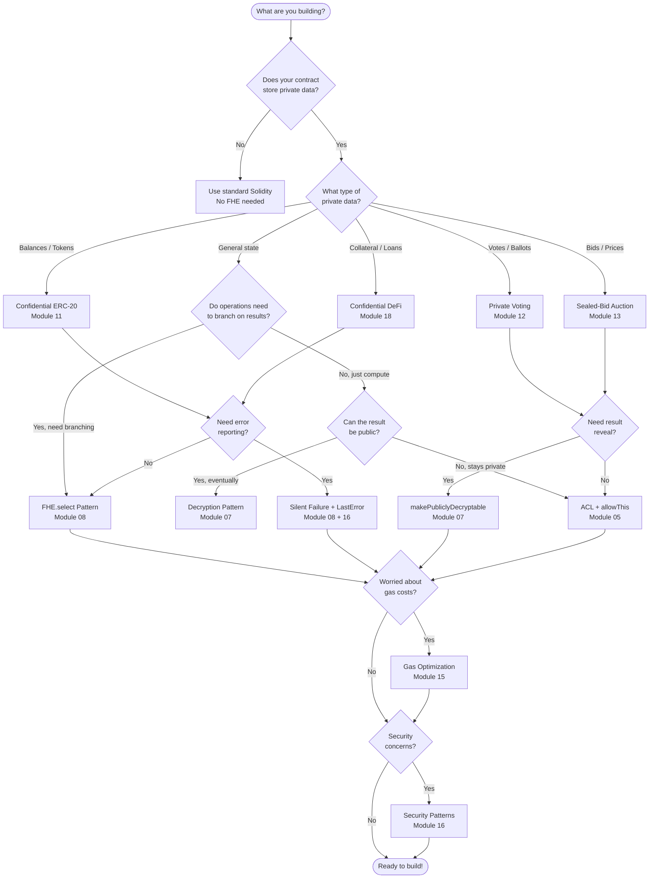

# FHE Pattern Decision Tree

> "Which FHE pattern should I use?" — A quick-reference guide for choosing the right approach.

## Flowchart

## Quick Reference Table

| Scenario | Pattern | Key Module | Key Functions |
|----------|---------|------------|---------------|
| Private token balances | Confidential ERC-20 | 11 | `FHE.add`, `FHE.sub`, `FHE.select` |
| Secret voting | Private Voting | 12 | `FHE.select`, `makePubliclyDecryptable` |
| Hidden bids | Sealed-Bid Auction | 13 | `FHE.gt`, `FHE.select`, `userDecrypt` |
| Error without reverting | Silent Failure | 08, 16 | `FHE.select` + LastError enum |
| Conditional state update | FHE.select | 08 | `FHE.select(condition, ifTrue, ifFalse)` |
| Let user see their data | User Decryption | 07 | `FHE.allow`, `userDecrypt` |
| Make data fully public | Public Decryption | 07 | `makePubliclyDecryptable` |
| Cross-contract FHE | Advanced Patterns | 17 | `FHE.allowTransient`, `FHE.allow` |
| On-chain randomness | FHE Randomness | 09 | `FHE.randEuintXX()` |
| Small value optimization | Gas Optimization | 15 | Use `euint8` instead of `euint64` |
| Known constant in math | Plaintext Operand | 15 | `FHE.add(enc, 10)` not `FHE.add(enc, FHE.asEuint32(10))` |

## Common Anti-Patterns

1. **Branching on encrypted data** — `if (FHE.gt(a, b))` does NOT work. Use `FHE.select()` instead.
2. **Using `require()` with FHE comparison** — `ebool` cannot be used in `require()`. Use the Silent Failure pattern.
3. **Over-sized encrypted types** — Don't use `euint64` for values that fit in `euint8`. Smaller types = cheaper gas.
4. **Encrypting constants** — `FHE.add(enc, FHE.asEuint32(10))` wastes gas. Use `FHE.add(enc, 10)` with a plaintext operand.
5. **Missing ACL grants** — After every state update, call `FHE.allowThis()` and `FHE.allow(value, user)`.
6. **Forgetting `FHE.isInitialized()`** — Always validate `FHE.fromExternal()` results before using them.
7. **Marking FHE functions as `view`** — FHE operations modify internal state. They cannot be `view` or `pure`.
